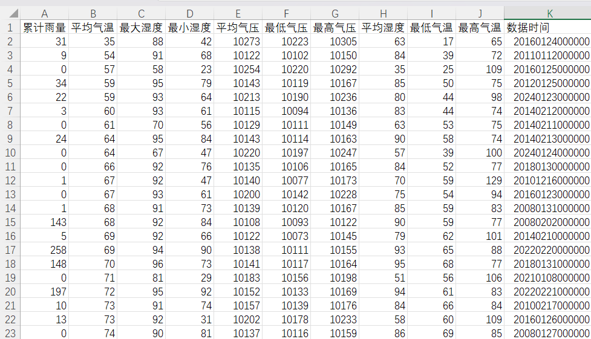
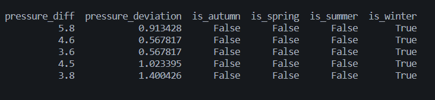
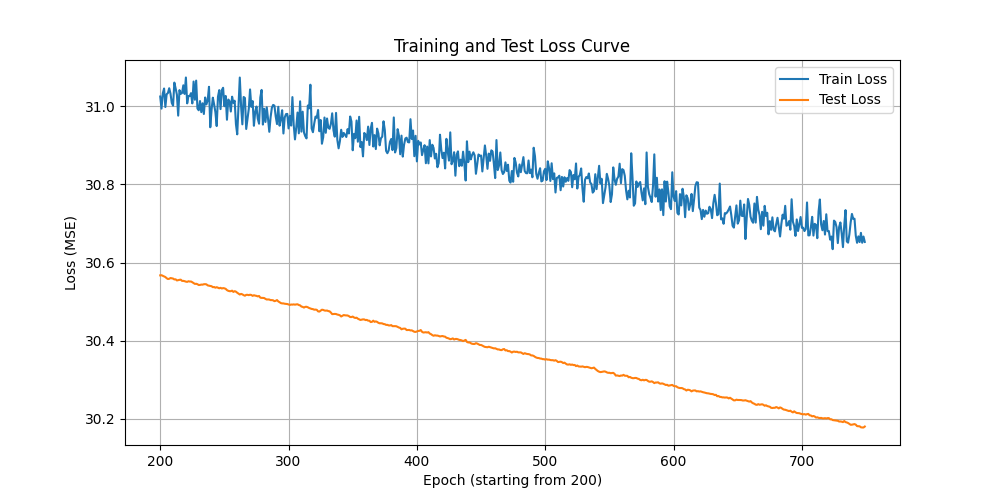
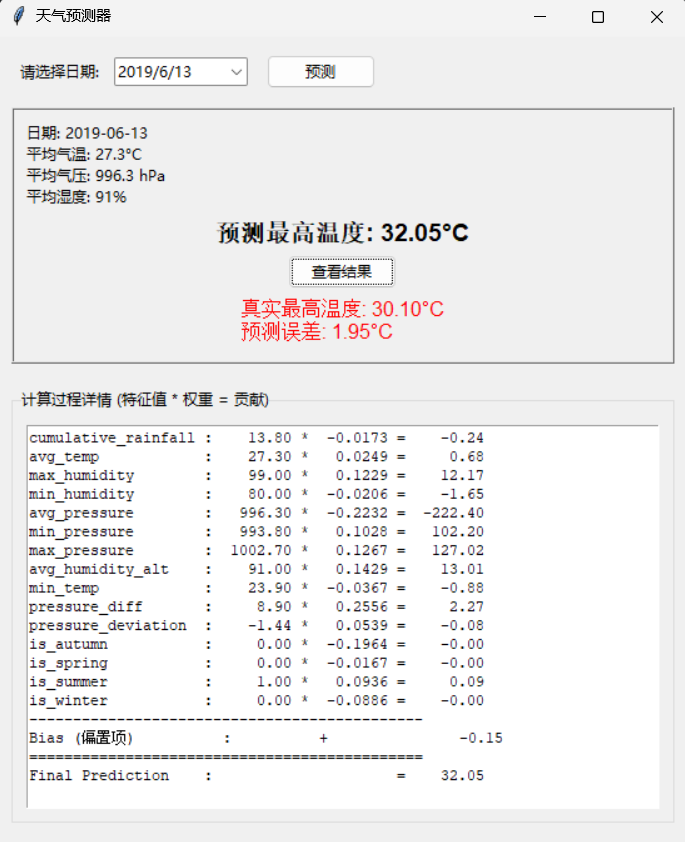

## **项目说明书：基于线性回归的深圳每日最高气温预测**

### **1. 问题描述**

本项目旨在利用公开的深圳国家气象站历史气象数据，构建一个机器学习模型，以预测每日的最高气温。准确的气温预测在农业生产、能源调度、公共卫生及日常生活中具有重要的应用价值。项目的核心挑战在于如何从多个相关的气象特征中，学习到它们与最高气温之间的定量关系。
数据集图例：数据共6296条，从2007年1月1日到2024年3月27日

### **2. 问题建模**

我们将此问题建模为一个**监督学习中的多元线性回归任务**。
*   **目标变量 (Target, y):** `max_temp` (每日最高气温)，一个连续的数值。
*   **特征 (Features, X):** 10个从数据集中直接获取的数值特征（如气压、湿度、最低温等），以及2个我们通过特征工程创建的新特征。
*   **模型假设:** 我们初步假设这些特征与最高气温之间存在一种**线性关系**，即 `max_temp ≈ W * X + b`。

### **3. 数据探索与清洗**

*   **数据源:** 深圳气象局2007-2024年国家气象站日数据集 (`DData.csv`)。
*   **数据探索 (EDA):** 通过对数据的初步探查，我们发现了几个关键问题：
    1.  **数据格式不一致:** 日期列以一种包含了时分秒的长整数/科学记数法字符串形式存在。
    2.  **数值尺度问题:** 所有温度和气压值都被放大了10倍存储。
    3.  **潜在的缺失/无效值:** `cumulative_rainfall`列中存在缺失值，且部分列可能因读取错误混入非数值字符。
*   **数据清洗流程:**
    1.  **加载数据:** 在加载时精确定义11个列的名称，并强制将日期列读作字符串以避免精度损失。
    2.  **类型转换:** 将所有数值列强制转换为`float`类型，并将无法转换的“坏数据”标记为`NaN`。
    3.  **缺失值处理:** 对`cumulative_rainfall`的`NaN`值用`0`进行填充（假设无记录即无降雨），并移除了在其他关键特征上包含`NaN`的行。

### **4. 特征工程**

为了增强模型的表达能力，我们从原始数据中提取了新的信息：

1.  **数值修正:** 将所有温度和气压值除以10，恢复其真实的物理尺度。
2.  **季节特征:**
    *   通过精确的数学运算 (`// 1000000`) 从日期长整数中提取出`YYYYMMDD`格式。
    *   利用`lunardate`库计算中国的二十四节气，将每个日期映射到其所属的季节（春、夏、秋、冬）。
    *   对季节这个类别特征进行**独热编码**，生成`is_spring`, `is_summer`等4个二元特征，避免了模型对季节引入错误的序数关系。

3.  **衍生特征:**
    *   **气压差 (`pressure_diff`):** `max_pressure - min_pressure`，用于捕捉当天的气压日变化幅度。
    *   **气压偏离度 (`pressure_deviation`):** `avg_pressure - 总体平均气压`，用于衡量当天气压相对于历史平均水平的异常程度。

### **5. 模型训练**

*   **数据集分割:** 将处理好的数据集按照80/20的比例，随机分割为**训练集**和**测试集**。
*   **数据封装:** 使用PyTorch的`TensorDataset`将特征和标签配对，再用`DataLoader`实现数据的高效批量加载和随机打乱。
*   **模型架构:** 构建了一个简单的**单层线性回归模型 (`torch.nn.Linear`)**，其输入维度等于特征数量，输出维度为1。
*   **核心训练流程 (基于PyTorch `autograd`机制):**
    1.  **定义损失函数:** 采用**均方误差损失 (MSE, `nn.MSELoss`)** 来衡量预测误差的平方。
    2.  **定义优化器:** 选择**随机梯度下降 (SGD, `torch.optim.SGD`)** 作为参数更新的算法，并集成了**L2正则化 (权重衰减, `weight_decay`)** 来防止过拟合。
    3.  **训练循环:** 在指定的`num_epochs`内，模型按照“**清零梯度 -> 前向传播 -> 计算损失 -> 反向传播 -> 更新参数**”的五步法，在训练集上迭代学习。
*   **超参数选择:** 通过手动调试，我们选择了一组能够使模型稳定收敛的超参数（如`learning_rate=1e-12`, `num_epochs=1000`等）。

一轮训练如下：
```python
for i, (features, labels) in enumerate(train_loader):
    # 1. 清空梯度
    optimizer.zero_grad()
        
    # 2. 前向传播
    outputs = model(features)
        
    # 3. 计算损失
    loss = loss_fn(outputs, labels)
        
    # 4. 反向传播
    loss.backward()
        
    # 5. 更新参数
    optimizer.step()
        
    # 累加训练损失
    current_train_loss += loss.item()
```
### **6. 结果分析与应用**

*   **可视化分析:** 通过绘制测试集损失在训练过程中的下降曲线，我们观察到模型能够有效收敛，最终的**均方根误差(RMSE)** 稳定在一个较低的水平。

*   **最佳/最差案例分析:** 通过检查模型在测试集上误差最大和最小的样本，我们发现模型在冬季/极端高温的预测效果相对较差，这可能暗示:
    - 天气模式中存在线性模型无法捕捉的**非线性关系**。
    - 训练数据较少，导致小概率事件 **(强寒潮，酷暑)** 在模型上没有得到反映。
*   **GUI应用:** 为了将模型应用落地，我们开发了一个独立的`tkinter`图形界面程序。该程序可以：
    1.  从`.csv`和`.txt`文件中加载训练好的模型权重和偏置。
    2.  提供日历供用户选择日期。
    3.  从原始数据源查询数据，并**复现与训练时完全一致的特征工程流程**。
    4.  通过手动矩阵运算 (`W*X+b`) 计算预测结果，并与真实值对比，展示误差。

**GUI图例：**
   

### **7. 未来展望**

本项目成功地构建了一个端到端的机器学习流程，但仍有巨大的提升空间：

1.  **模型复杂度提升:**
    *   引入**多层感知机 (MLP)** 并使用**ReLU**等非线性激活函数，以捕捉天气系统中复杂的非线性关系，有望显著改善冬季等复杂情况下的预测精度。
    *   尝试**梯度提升树模型 (如XGBoost)**，它们在处理表格类数据上通常有顶级的表现。
2.  **引入时间序列信息:**
    *   当前模型只使用了当天的数据。未来可以引入过去N天（如7天）的天气数据作为特征，让模型学习到天气变化的**时间依赖性**。**LSTM**或**GRU**等循环神经网络是实现这一点的理想工具。
3.  **更深入的特征工程:**
    *   可以创建更多有物理意义的交互特征，如“湿度与温度的交互项”、“风速与气压的交互项”等。
4.  **超参数自动优化:**
    *   使用**网格搜索 (Grid Search)** 或**贝叶斯优化**等技术，来系统性地寻找最佳的超参数组合，而不是依赖手动调试。

---